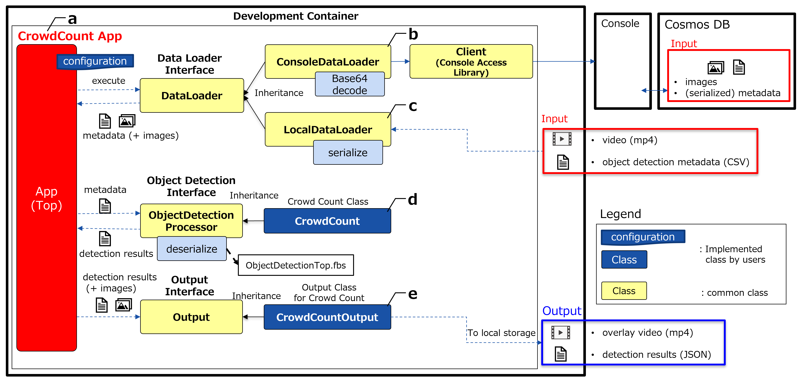

# Crowd Count: Sample Application on AITRIOS

## Contents
- [Overview](#overview)
- [Get started](#getting-started)
- [Tutorial](#tutorial)
- [Specifications](#specifications)
  - [Algorithm and parameters](#algorithm-and-parameters)
  - [Design diagram](#design-diagram)
- [Tips](#tips)
- [Get support](#get-support)
- [See also](#see-also)
- [Trademark](#trademark)
- [Notice](#notice)


## Overview

This repository provides sample code for a crowd counting application using [Cloud SDK for Python](https://github.com/SonySemiconductorSolutions/aitrios-sdk-console-access-lib-python), as well as configuration files for building a development environment. This application retrieves Human detection model metadata from Console and counts the number of people within an arbitrary number of polygons.


### Restrictions

None


## Get started

### Build an environment and get started with the demo application

1. Clone or fork this application in your GitHub environment.
2. Click the `+` button to create a codespace on the GitHub environment. See [how to create a codespace](https://docs.github.com/en/codespaces/developing-in-codespaces/creating-a-codespace-for-a-repository).
> **Note**
> Please select a machine type with 16 cores and 32GB of RAM for smmoth operation of the application.
3. Run the demo application using the following command
    ```
    python src/crowd_count_app.py
    ```
4. (Optional) Run the demo application with a custom configuration using the following command
    ```
    python src/crowd_count_app.py --config_path /path/to/yaml
    ```
You can get the overlay video and the count value in JSON format using this application.

## Tutorial

### 1. Prepare your device to run inference

To run this application using data inferred from an actual device, it is necessary to set up the device first.

#### Step 1-1: Setup the inference device

Before running this application, you need to complete account setup, environment setup, AI model preparation, and device deployment.

See [Development guides Get started](https://developer.aitrios.sony-semicon.com/development-guides/get-started) for details.

> **Note**
> You need to import a Human Detection AI model created with Custom Vision and corresponding PPL.

#### Step 1-2: Set the Command Parameter file

The Command Parameter file must be set appropriately. Here is an example of parameter settings:

```
{
    "commands" : [
        {
            "command_name":"StartUploadInferenceData",
            "parameters": {
                "Mode": 1,
                "NumberOfImages": 0,
                "UploadInterval": 100,
                "ModelId": "SampleApp-HumanDetection",
                "PPLParameter": {
                    "header": {
                        "id": "00",
                        "version": "01.01.00"
                    },
                    "dnn_output_detections" : 64,
                    "max_detections" : 5,
                    "threshold" : 0.1,
                    "input_width" : 320,
                    "input_height" : 320 
                }
            }
        }
    ]
}
```

#### Step 1-3: Start inference and confirm data acquisition

When the device and parameters are ready, turn on the `Get Inference Data` toggle in Console to start inference. Since `NumberOfImages` is 0, data will continue to be captured until the button is pressed again. After that, check whether the data has been acquired with `Check data` on Console.

See Console User Manual for details.


### 2. Set configuration parameters to start the sample application

There are several configuration files that need to be set up properly for this application to work. Here, you will learn how to set those parameters step by step.

#### Step 2-1: Choose input data

This application can input data not only from Console for AITRIOS but also from local sources. You have to edit the `data_source_settings` section in [config\crowd_count_app.yaml](./config/crowd_count_app.yaml) in the codespace or the environment where the repository was cloned. Here, we will explain 4 input patterns. If you do not use image data, the overlay video will not be included in the output data.

##### Case 1: Use images and metadata from Console

First, the `mode` parameter must be set to `"console"` to get data from Console. You also need to set the `sub_directory_name` parameter to the directory name that contains the target images. For that, you may need to actually check the Console screen to see which directory the image you want is in.

The minimum required parameters are as follows.
- `mode`: `"console"`
- `setting_path`: The path to [config/console_access_settings.yaml](./config/console_access_settings.yaml)
- `device_id`: Your Device ID
- `sub_directory_name`: The name of the subdirectory where the target images are stored
- `number_of_images`: The maximum number of images to get

Here is an example.
```
data_source_settings:
  mode: "console"
  console_data_settings:
    setting_path: "./config/console_access_settings.yaml"
    device_id: "__device_id__"
    sub_directory_name: "__sub_directory_name__"
    first_timestamp: "yyyyMMddHHmmssfff"                   # invalid
    last_timestamp: "yyyyMMddHHmmssfff"                    # invalid
    number_of_inference_results: 20                        # invalid
    number_of_images: 20
  local_data_settings:
    video_file: "__path_to_video_file__"                   # invalid
    meta_file: "__path_to_csv_meta_file__"                 # invalid
```

##### Case 2: Use only metadata from Console

> **Note**
> The overlay video will not be output in this case.

The `sub_directory_name` parameter must be set to `""`(empty string) in this case. Also, you can specify a range of metadata to be acquired by the `first_timestamp` and `last_timestamp` parameters.

The minimum required parameters are as follows.

- `mode`: `"console"`
- `setting_path`: The path to [config/console_access_settings.yaml](./config/console_access_settings.yaml)
- `device_id`: Your Device ID
- `sub_directory_name`: `""`
- `first_timestamp`: The earliest timestamp of the target metadata in string format or `""`(empty string)
- `last_timestamp`:  The latest timestamp of the target metadata in string format or `""`(empty string)
- `number_of_inference_results`: The maximum number of metadata to get

`number_of_inference_results` must be set to a value greater than or equal to 1.
Here are the setting values for `first_timestamp` and `last_timestamp`, and the corresponding behaviors.

| `first_timestamp`     | `last_timestamp` | Behavior |
|-----------------------| --- | --- |
| `"yyyyMMddHHmmssfff"` |  `"yyyyMMddHHmmssfff"` | Get up to `number_of_inference_results` counted from the latest metadata from `first_timestamp` to `last_timestamp` |
| `"yyyyMMddHHmmssfff"` | `""` | Get up to `number_of_inference_results` counted from the latest metadata from `first_timestamp` to now |
| `""`                  | `"yyyyMMddHHmmssfff"` | Get up to `number_of_inference_results` counted from the latest metadata before `last_timestamp` |
| `""`                  | `""` | Get up to `number_of_inference_results` from the latest metadata |


Here is an example.
```
data_source_settings:
  mode: "console"
  console_data_settings:
    setting_path: "./config/console_access_settings.yaml"
    device_id: "__device_id__"
    sub_directory_name: ""                                 # Do not specify an Image node
    first_timestamp: "yyyyMMddHHmmssfff"
    last_timestamp: "yyyyMMddHHmmssfff"
    number_of_inference_results: 20
    number_of_images: 20                                   # invalid
  local_data_settings:
    video_file: "__path_to_video_file__"                   # invalid
    meta_file: "__path_to_csv_meta_file__"                 # invalid
```

##### Case 3: Use local video and metadata

> **Note**
> The parameters in console_data_settings are ignored in this case.

You can directly input a video and metadata without Console. You have to prepare the video in MP4 format and the metadata in CSV format. See the [CSV format](input/sample.csv) for details

The minimum required parameters are as follows.

- `mode`: `"local"`
- `video_path`: The path to the local video
- `meta_file`: The path to the local metadata

Here is an example.
```
data_source_settings:
  mode: "local"
  console_data_settings:
    setting_path: "./config/console_access_settings.yaml"  # invalid
    device_id: "__device_id__"                             # invalid
    sub_directory_name: "__sub_directory_name__"           # invalid
    first_timestamp: "yyyyMMddHHmmssfff"                   # invalid
    last_timestamp: "yyyyMMddHHmmssfff"                    # invalid
    number_of_inference_results: 20                        # invalid
    number_of_images: 20                                   # invalid
  local_data_settings:
    video_file: "./input/sample.mp4"
    meta_file: "./input/sample.csv"
```

##### Case 4: Use only local metadata

> **Note**
> The parameters in console_data_settings are ignored in this case.
> The overlay video will not be output in this case.

- `mode`: `"local"`
- `video_path`: `""` (empty string)
- `meta_file`: The path to the local metadata

Here is an example.
```
data_source_settings:
  mode: "local"
  console_data_settings:
    setting_path: "./config/console_access_settings.yaml"  # invalid
    device_id: "__device_id__"                             # invalid
    sub_directory_name: "__sub_directory_name__"           # invalid
    first_timestamp: "yyyyMMddHHmmssfff"                   # invalid
    last_timestamp: "yyyyMMddHHmmssfff"                    # invalid
    number_of_inference_results: 20                        # invalid
    number_of_images: 20                                   # invalid
  local_data_settings:
    video_file: ""                                         # Do not specify
    meta_file: "./input/sample.csv"
```

#### (Only for Case 1 and Case 2) Edit console_access_settings.yaml

You have to edit [console_access_settings.yaml](./config/console_access_settings.yaml) to log in to Console.

```
console_access_settings:
  console_endpoint: "__console_endpoint__"
  portal_authorization_endpoint: "__portal_authorization_endpoint__"
  client_secret: "__client_secret__"
  client_id: "__client_id__"
```

See the [Portal user manual](https://developer.aitrios.sony-semicon.com/en/documents/portal-user-manual) for details.


#### Step 2-2: Set application parameters

##### Step 2-2-1: Edit crowd_count_settings

In [crowd_count_app.yaml](./config/crowd_count_app.yaml), set `param_file` to the path of the configration file used for crowd counting processing.

```
crowd_count_settings:
  param_file: "./config/default_param.yaml"
```

##### Step 2-2-2: Set counting algorithm parameters

You can adjust the count parameters according to your own environment. The following is an example. See the [Specifications](#algorithm-and-parameters) for details.

```default_param.yaml
remove_low_conf:
  min_detect_score: 0.0
  max_height: 300
  min_height: 0

bbox2point:
  bbox_to_point_ratio: 0.1

inpolygon:
  area_num: 1
  area_point_len: [4,0,0,0]
  area_point: [
                [[250,50],[250,250],[50,250],[50,50],[0,0],[0,0],[0,0],[0,0],[0,0],[0,0],[0,0],[0,0],[0,0],[0,0],[0,0],[0,0]],
                [[0,0],[0,0],[0,0],[0,0],[0,0],[0,0],[0,0],[0,0],[0,0],[0,0],[0,0],[0,0],[0,0],[0,0],[0,0],[0,0]],
                [[0,0],[0,0],[0,0],[0,0],[0,0],[0,0],[0,0],[0,0],[0,0],[0,0],[0,0],[0,0],[0,0],[0,0],[0,0],[0,0]],
                [[0,0],[0,0],[0,0],[0,0],[0,0],[0,0],[0,0],[0,0],[0,0],[0,0],[0,0],[0,0],[0,0],[0,0],[0,0],[0,0]]
              ]

stabilizer:
  iir_up_ratio: 0
  iir_down_ratio: 0
```


#### Step 2-3: Edit output parameters

In output_settings of [crowd_count_app.yaml](./config/crowd_count_app.yaml), edit the output parameters. The detection result json files and overlay video are stored accordingly. If you do not input image data, only the detection result json files will be output.

* `output_dir`: The path of the directory to store the output results of the Crowd Count Application
* `output_vide_fps`: Frame rate of the overlay video
* `output_video_width`: Width of the overlay video
* `output_video_height`: Height of the overlay video

Here is an example.
```
output_settings:
output_dir: "output"
output_video_fps: 15
output_video_width: 300
output_video_height: 300
```

## Specifications

### Algorithm and parameters

This application counts how many people are in the specified area of the image using the result of human
detection. There are four blocks to accurately count people.

#### 1. Remove Low Confidence

This block excludes unreliable detections from further calculations. You can also limit the size of the bounding
box as well as the detection confidence.

#### 2. Convert bounding box to point

This block converts from the bounding box of the detection result to the coordinates of one point. You can set
the vertical position as a ratio.

#### 3. Inpolygon

This block determine if the coordinates are inside any polygon. You can set up to 4 hexadecagons.

#### 4. Stabilizer

This block stabilizes in the time direction when the performance of the detector is chronologically unstable.

These blocks are controlled by the parameters described in [Step 2-2-2](#step-2-2-2-set-counting-algorithm-parameters), as follows.

| Block | Parameter | Explanation | Range | 
| -- | -- | -- | -- |
| remove_low_conf | min_detect_score | Minimum score of the input detection result usedfor counting | 0.0~1.0 | 
| remove_low_conf | max_height | Maximum height of bounding box used for counting | 0~ |
| remove_low_conf | min_height | Minimum height of bounding box used for counting | 0~ |
| bbox2point | bbox_to_point_ratio | Vertical position ratio when converting frombounding box to point | 0.0~1.0 |
| inpolygon | area_num | Number of count areas | 1~4 |
| inpolygon | area_point_len | Number of polygon sides per area | 3~16 |
| inpolygon | area_point | Coordinates of the polygon in clockwise direction for each area (x, y) | 0~ |
| stabilizer | iir_up_ratio | IIR coefficient in the direction of increasing counts |  0.0~1.0 |
| stabilizer | iir_down_ratio | IIR coefficient in the direction of decreasing counts | 0.0~1.0 |


### Design diagram

This sample application (figure a) gets data not only through  ConsoleDataLoader (figure b), but also through  LocalDataLoader (figure c).
ConsoleDataLoader loads images and metadata form Console using [Console Access Library for Python](https://github.com/SonySemiconductorSolutions/aitrios-sdk-console-access-lib-python). LocalDataLoader directly loads a mp4 video and metadata in CSV format.

CrowdCount (figure d) counts the number of people in the area set by the user, and then CrowdCountOutput (figure e) saves the detection results and overlay video (figure e part).




### Tips

Here are some tips for using this sample application more efficiently and effectively.

#### How to get metadata efficiently

This sample application uses [Console Access Library for Python](https://github.com/SonySemiconductorSolutions/aitrios-sdk-console-access-lib-python) to get images and metada. The simplest way to get images and metadata is as follows. You get the images with the `get_images` API and look at the timestamps in the image filenames. Then you get the corresponding metadata with the `get_inference_resuts` API.
However, it takes time to obtain multiple metadata with the `time` option of the `get_inference_results` API, where only one metadata can be specified.

You can use the `filter` option of the `get_inference_results` API to batch access metadata with specified timestamps, as follows.

```
first_timestamp = 'yyyyMMddHHmmssfff' # the earliest time
last_timestamp = 'yyyyMMddHHmmssfff' # the latest time

filter_str = 'EXISTS(SELECT VALUE i FROM i IN c.Inferences WHERE i.T >= "{first_timestamp}" AND i.T <= "{last_timestamp}")'

# you can get multiple metadata at once.
console_access_client.insight.get_inference_results(
    'your_device_id',
    raw=1,
    filter=filter_str)
```

See [code](src/console_data_loader.py?plain=1?#L167-L194) for details.

#### Image and metadata time synchronization

Image and metadata time synchronization is necessary for the application to work properly.
In this application, we check the timestamps of the images and metadata to ensure that only synchronized data is input to `CrowdCount`.

```
# Synchronized metadata
match_meta_data_list = []

# image timestamp loop
for image_time in image_time_list:
    match_flag = False
    for meta_time, meta_data in zip(
        meta_time_list, meta_data_list):
        if meta_time == image_time:
            match_meta_data_list.append(meta_data)
            match_flag = True
            break
    if match_flag is False:
        match_meta_data_list.append(None)
```
See [code](src/console_data_loader.py?plain=1?#L216-L233) for details.

#### Point in Polygon

In actual use cases, the counting area is often not a simple rectangle, so the algorithm is designed so that the area can be set to any polygon. This application uses the Ray casting Algorithm due to its simplicity of implementation and flexibility of polygons.

#### Stability over time

Due to the characteristics of AI-based detection, the count numbers in the time domain are often unstable. If the accuracy of the detector is low, stabilization processing in the time domain is required to improve performance. As a solution, Infinite Impulse Response (IIR) filtering can be used to stabilize the count numbers. However, the choice of appropriate stabilization method depends on the specific circumstances and needs to be evaluated accordingly.

This IIR algorithm is as follows.

1. For the initial frame, output the computed number of people without any changes.
2. If the computed count value (`current_count`) is greater than the output of the previous frame's IIR filtering (`previous_count`), set the `iir_ratio` to `iir_up_ratio`.
3. If the computed count value is less than or equal to the output of the previous frame's IIR filtering, set the `iir_ratio` to `iir_down_ratio`.

The calculation for IIR filtering is as follows:
`output_count` = `previous_count` * `iir_ratio` + `current_count` * (1.0 - `iir_ratio`).

For example, if the number of false positives (FP) equals the number of false negatives (FN), the `iir_up_ratio` is set equal to `iir_down_ratio`. When the number of false positives (FP) is less than the number of false negatives (FN), the `iir_up_ratio` is set lower than `iir_down_ratio`.


## Get support

- [Contact us](https://developer.aitrios.sony-semicon.com/contact-us/)

## See also

- [aitrios-sdk-console-access-lib-python](https://github.com/SonySemiconductorSolutions/aitrios-sdk-console-access-lib-python)
- [aitrios-sdk-cloud-app-sample-python](https://github.com/SonySemiconductorSolutions/aitrios-sdk-cloud-app-sample-python)


## Trademark
- [Read This First](https://developer.aitrios.sony-semicon.com/development-guides/documents/manuals/)

## Notice

### Security
Before using Codespaces, please read the Site Policy of GitHub and understand the usage conditions.
